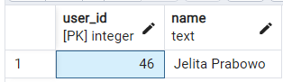
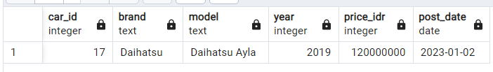
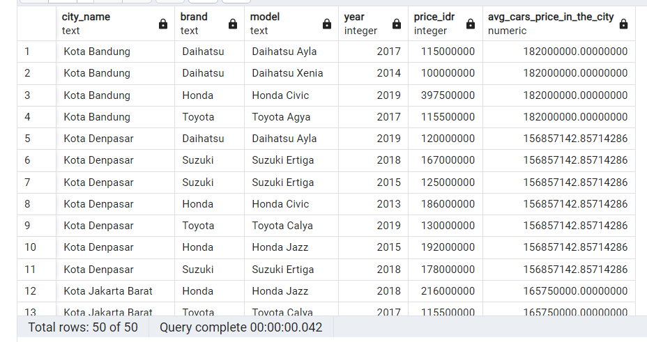

# Latar belakang
Ini adalah relational database untuk sebuah website yang menawarkan penjualan mobil bekas. Siapa saja dapat menawarkan produknya (mobil bekas) dalam bentuk iklan dan calon pembeli dapat melakukan pencarian berdasarkan beberapa kategori.

# Kebutuhan
1. Setiap user dapat menawarkan lebih dari satu produk mobil bekasnya.
2. Sebelum menjual produk mobil, user harus melengkapi data dirinya terlebih dahulu, seperti nama, kontak, dan domisili lokasi.
3. User menawarkan produknya melalui iklan yang akan ditampilkan oleh website.
4. Iklan ini berisikan judul, detail informasi produk yang ditawarkan, serta kontak penjual.
5. Beberapa informasi yang harus ditulis dalam iklan adalah sebagai berikut
    * merek mobil: Toyota, Daihatsu, Honda, dll
    * Model: Toyota Camry, Toyota Corolla Altis, Toyota Vios,Toyota Camry Hybrid, dll
    * Jenis body mobil: MPV, SUV, Van, Sedan, Hatchback, dll
    * Tipe mobil: manual atau automatic
    * Tahun pembuatan mobil: 2005, 2010, 2011, 2020 
    * Deskripsi lain, seperti warna, jarak yang telah ditempuh, dsb,  boleh ditambahkan sesuai kebutuhan.
6. Setiap user bisa mencari mobil yg ditawarkan berdasarkan lokasi user penjual, merk mobil, dan jenis body mobil.
7. Jika calon pembeli tertarik terhadap sebuah mobil, ia dapat menawar (bid) harga produk jika penjual mengizinkan fitur tawar. 
8. Transaksi pembelian dilakukan di luar aplikasi, tidak termasuk scope pembahaasan ini.

# Database design
Kita mulai dari tabel yang paling sederhana, tidak memerlukan referensi ke tabel lain: table `cities`.
## cities
```
CREATE TABLE cities (
  city_id SERIAL PRIMARY KEY,
  city_name TEXT NOT NULL,
  latitude NUMERIC(8, 6) NOT NULL,
  longitude NUMERIC(9, 6) NOT NULL,
  UNIQUE(latitude, longitude)
);
```
Semua memiliki constraint `NOT NULL` karena setiap kota pasti memiliki nama (`city_name`) dan lokasinya pada garis lintang (`latitude`) dan bujur (`longitude`). Kombinasi garis lintang dan bujur tersebut harus `UNIQUE` karena tidak ada kota yang berada di posisi geografis yang sama. Digunakan nomor `SERIAL` saja untuk `PRIMARY KEY` karena kandidat `city_name` bisa saja memiliki nama sama sementara jika menggunakan `latitude` dan `longitude` sebagai primary key (PK) terlalu rumit.

##  users
```
CREATE TABLE users (
  user_id SERIAL PRIMARY KEY,
  name TEXT NOT NULL,
  phone_number TEXT UNIQUE NOT NULL,
  city_id INTEGER NOT NULL REFERENCES cities(city_id)
);
```
Digunakan `user_id` sebagai PK untuk kemudahan. Seorang user diwajibkan memiliki `name` dan `phone_number`. Beberapa orang bisa memiliki nama yang sama sementara nomor telepon diwajibkan hanya mewakili satu user sehingga `UNIQUE`. User perlu memilih domisili dari daftar kota yang sudah ada di `cities`, terhubung via `city_id` sebagai foreign key (FK). Ini memberikan kontrol bagi pemilik  platform untuk mengatur area layanannya.

## cars
```
CREATE TABLE cars (
  car_id SERIAL PRIMARY KEY,
  brand TEXT NOT NULL,
  model TEXT NOT NULL,
  body_type TEXT NOT NULL,
  price_idr INTEGER NOT NULL,
  year INTEGER NOT NULL
);
```
Dasar pemilihan PK sama seperti sebelumnya. Setiap mobil pasti memiliki `brand`, `model`, dan memiliki `body_type` tertentu. Kolom harga diwakili `price_idr` untuk memperjelas harga di dalam rupiah dan tahun produksi `year` mobil bekas diwajibkan untuk diisi karena bisa mewakili ekspektasi kondisi dan spesifikasi mobil.

## ads
```
CREATE TABLE ads (
  ad_id SERIAL PRIMARY KEY,
  user_id INTEGER NOT NULL REFERENCES users(user_id),
  car_id INTEGER NOT NULL REFERENCES cars(car_id),
  title TEXT NOT NULL,
  description TEXT NOT NULL,
  mileage_km INTEGER NOT NULL,
  color TEXT NOT NULL,
  transmission TEXT NOT NULL,
  negotiable BOOLEAN NOT NULL,
  post_date DATE NOT NULL
);
```
Pemasang iklan `user_id` (FK ke `users`) saat memasukkan data mobilnya akan masuk ke tabel `cars` dan `ads`. Dua tabel ini terhubung via `car_id` (FK ke `cars`). Skema di atas perlu ditambahin constraint supaya `cars` dan `ads` memiliki relasi 1:1. Semua kolom `NOT NULL` agar informasi tentang mobil bekas cukup jelas. Tiap kolom sudah cukup menjelaskan. Kolom `negotiable` menjadi penentu apakah iklan/mobil ini dapat ditawar lewat tabel `bids` atau tidak.

## bids
```
CREATE TABLE bids (
  bid_id SERIAL PRIMARY KEY,
  user_id INTEGER NOT NULL REFERENCES users(user_id),
  ad_id INTEGER NOT NULL REFERENCES ads(ad_id),
  bid_price_idr INTEGER NOT NULL,
  bid_date DATE NOT NULL
);
```
User dengan relasi `user_id` dapat beberapa kali melakukan bidding terhadap suatu `ad_id`. Perlu ada constraint agar `user_id` tidak dapat melakukan bid pada iklan `ad_id` yang dibuatnya sendiri. Dalam melakukan suatu bid, sudah pasti ada tawaran harga `bid_price_idr`. Ini bukan berupa pengurangan harga mobil, melainkan harga yang diinginkan calon pembeli terhadap mobil di iklan tersebut. Saat melakukan bid, tentu ada tanggal `bid_date` kapan user melakukannya.

## ERD

Dimulai dari table `cities` yang hanya dirujuk oleh `users`. User lalu dapat membuat dua hal, `ads` atau `bids`. Jika membuat iklan, maka akan memasukkan data pada `cars` juga. Saat melakukan bid, bid  tersebut harus merujuk pada salah satu ad.


# Dummy data
Bisa langsung gunakan backup database yang tersedia atau untuk generate sendiri dummy data secara random, bisa masuk ke folder dummy-data dan eksekusi menggunakan `python` file-file `.py` dengan urutan sesuai yang ada di file `generate-dummies.ps1`:
```
py gen_dummy_users.py
py gen_dummy_ads.py
py input_cities.py
py input_users.py
py input_cars.py
py input_ads.py
py input_gen_dummy_bids.py
```
File-file tersebut baru bisa berjalan jika ada file `db_secrets.py` yang isinya mengikuti pola `db_secrets_example.py` sebagai berikut.
```
DB_NAME = "pac02-sql_used_cars"
DB_USER = "<user postgresql>"
DB_PASS = "<pass user postgresql>"
DB_HOST = "localhost"
```
Isi `DB_NAME`, `DB_USER` dan seterusnya sesuai dengan kondisi server database postgresql Anda.

# Contoh retrieve data
## Transactional
Lihat file `01-transactionals.sql`.
### Contoh 1
Mencari mobil keluaran 2015 ke atas.
```
SELECT *
FROM cars
WHERE year >= 2015;
```


### Contoh 2
Menambahkan satu data bid produk baru
```
INSERT INTO bids
	(user_id, ad_id, bid_price_idr, bid_date)
VALUES
	(50, 16, 70000000, '2023-02-15');

-- view added bid
SELECT c.car_id, b.user_id, bid_date, bid_price_idr
FROM bids b
LEFT JOIN ads a 
ON b.ad_id = a.ad_id
LEFT JOIN cars c
ON a.car_id = c.car_id
WHERE a.ad_id = 16;
```


### Contoh 3
Melihat semua mobil yg dijual 1 akun dari yg paling baru.
Ambil nama secara random.
```
SELECT users.user_id, users.name
FROM ads
LEFT JOIN users
ON ads.user_id = users.user_id
ORDER BY random()
LIMIT 1;
```


Cari iklan oleh user tersebut.
```
SELECT cars.car_id, brand, model, year, cars.price_idr, ads.post_date
FROM cars
LEFT JOIN ads
ON cars.car_id = ads.ad_id
WHERE ads.user_id = 46
ORDER BY ads.post_date DESC;
```


### Contoh 4
Mencari mobil bekas yang termurah berdasarkan keyword.
Keyword "Yaris".
```
SELECT car_id, brand, model, year, price_idr
FROM cars
WHERE model LIKE '%Yaris'
ORDER BY price_idr ASC;
```


### Contoh 5
Mencari mobil bekas yang terdekat berdasarkan sebuah id kota, jarak terdekat dihitung berdasarkan latitude longitude.
Definisikan function `haversine_distance`
```
CREATE OR REPLACE FUNCTION haversine_distance(lat1 FLOAT, lon1 FLOAT, lat2 FLOAT, lon2 FLOAT)
RETURNS DOUBLE PRECISION AS $$
DECLARE
	lat1 float := radians(lat1);
	lon1 float := radians(lon1);
	lat2 float := radians(lat2);
	lon2 float := radians(lon2);

	dlon float := lon2 - lon1;
	dlat float := lat2 - lat1;
	a float;
	b float;
	c float;
	r float := 6371;
	jarak float;
BEGIN
	-- haversine formula
	a := sin(dlat/2)^2 + cos(lat1) * cos(lat2) * sin(dlon/2)^2;
	c := 2 * asin(sqrt(a));
	jarak := r * c;
RETURN
	jarak;
END;
$$ LANGUAGE plpgsql;
```
Mencari mobil terdekat dengan id kota 3173. Urutkan semua mobil mulai dari jarak `distance` yang paling dekat.
```
SELECT cars.*,
	haversine_distance(
		(SELECT latitude FROM cities WHERE city_id = 3173),
		(SELECT longitude FROM cities WHERE city_id = 3173),
		cities.latitude,
		cities.longitude
	) AS distance,
	cities.city_name
FROM cars
LEFT JOIN ads
ON cars.car_id = ads.ad_id
LEFT JOIN users
ON ads.user_id = users.user_id
LEFT JOIN cities
ON users.city_id = cities.city_id
ORDER BY distance;
```


## Analytical
Lihat file `02-analyticals.sql`.
### Contoh 1
Ranking popularitas model mobil berdasarkan jumlah bid.
```
SELECT cars.model, COUNT(cars.car_id) as bid_count
FROM bids
LEFT JOIN ads
ON bids.ad_id = ads.ad_id
LEFT JOIN cars
ON ads.car_id = cars.car_id
GROUP BY cars.car_id
ORDER BY bid_count DESC;
```

### Contoh 2
Membandingkan harga mobil berdasarkan harga rata-rata mobil per kota.
```
-- Gunakan beberapa view
-- View car_cities didapat dengan join beberapa tabel dari cars -> ads -> users -> cities
CREATE OR REPLACE VIEW car_cities AS
SELECT
	cities.city_name,
	cars.brand,
	cars.model,
	cars.year,
	cars.price_idr
FROM cars
LEFT JOIN ads
ON cars.car_id = ads.car_id
LEFT JOIN users
ON ads.user_id = users.user_id
LEFT JOIN cities
ON users.city_id = cities.city_id;

-- View avg_price_per_city yaitu harga rata-rata semua mobil bekas terdata dalam suatu kota.
CREATE OR REPLACE VIEW avg_price_per_city AS
SELECT cities.city_name, AVG(cars.price_idr) as avg_price
FROM cars
LEFT JOIN ads ON cars.car_id = ads.car_id
LEFT JOIN users ON ads.user_id = users.user_id
LEFT JOIN cities ON users.city_id = cities.city_id
GROUP BY cities.city_name;

-- Join kedua view di atas
SELECT car_cities.*, avg_price_per_city.avg_price as avg_cars_price_in_the_city
FROM car_cities
LEFT JOIN avg_price_per_city
ON car_cities.city_name = avg_price_per_city.city_name
ORDER BY city_name;
```


### Contoh 3
Dari penawaran suatu model mobil, cari perbandingan tanggal user melakukan bid dengan bid selanjutnya beserta harga tawar yang diberikan. Bid untuk "Toyota Yaris"
```
-- Buat view semua bids untuk "Toyota Yaris"
CREATE OR REPLACE VIEW yaris_bids AS
SELECT
	cars.model, bids.user_id, bid_date, bid_price_idr
FROM cars
INNER JOIN ads
ON cars.car_id = ads.car_id
INNER JOIN bids
ON ads.ad_id = bids.ad_id
WHERE cars.model LIKE 'Toyota Yaris';
```
```
-- Hitung jumlah berapa kali user bid mobil tersebut sebagai pengecek
CREATE VIEW user_yaris_bid_count AS
SELECT
	user_id, COUNT(user_id) as bid_count
FROM yaris_bids
GROUP BY model, user_id;
SELECT * FROM user_yaris_bid_count;
```
```
-- Tampilkan bidding sekarang dan bidding setelahnya
SELECT
	yaris_bids.model, yaris_bids.user_id, bid_count,
	bid_date, bid_price_idr,
	LEAD(bid_date) OVER (PARTITION BY yaris_bids.user_id ORDER BY bid_date) as next_bid_date,
	LEAD(bid_price_idr) OVER (PARTITION BY yaris_bids.user_id ORDER BY bid_date) as next_bid_price_idr
FROM yaris_bids
LEFT JOIN user_yaris_bid_count
ON yaris_bids.user_id = user_yaris_bid_count.user_id
ORDER BY yaris_bids.user_id ASC, bid_date ASC;
```

### Contoh 4
Membandingkan persentase perbedaan rata-rata harga mobil berdasarkan modelnya dan rata-rata harga bid yang ditawarkan oleh customer pada 6 bulan terakhir.
```
--  View dari semua bid pada model-model selama 6 bulan terakhir
CREATE OR REPLACE VIEW model_bid_dates_6m AS
SELECT model, bid_price_idr, bid_date
FROM bids
LEFT JOIN ads
ON bids.ad_id = ads.ad_id
LEFT JOIN cars
ON ads.car_id = cars.car_id
WHERE bid_date >= NOW() - INTERVAL '6 months';
```
```
-- Hitung average dari harga iklan mobil dan average dari bid 6 bulan terakhir beserta selisih & persentasenya
SELECT
	cars.model,
	AVG(price_idr) AS avg_price,
	AVG(bid_price_idr) AS avg_bid_6month,
	AVG(price_idr) - AVG(bid_price_idr) AS difference,
	(AVG(price_idr)-AVG(bid_price_idr))/AVG(price_idr)*100 AS difference_percent
FROM model_bid_dates_6m
LEFT JOIN cars
ON model_bid_dates_6m.model = cars.model
GROUP BY cars.model;
```


### Contoh 5
Membuat window function rata-rata harga bid sebuah merk dan model mobil selama 6 bulan terakhir.
```
-- Subquery untuk menghitung rata-rata bid per bulan.
WITH monthly_avgs AS (
  SELECT
    DATE_TRUNC('month', bid_date) AS month,
    AVG(bid_price_idr) AS avg_bid_price_idr
  FROM yaris_bids
  GROUP BY DATE_TRUNC('month', bid_date)
)

-- Memanfaatkan subquery untuk menentukan periode berapa bulan ke belakang
SELECT
    yb.model,
    yb.bid_price_idr,
    yb.bid_date,
    AVG(yb.bid_price_idr) OVER (
        PARTITION BY DATE_TRUNC('month', yb.bid_date)
        ORDER BY yb.bid_date
        ROWS BETWEEN UNBOUNDED PRECEDING AND UNBOUNDED FOLLOWING
    ) AS avg_current_month,
    COALESCE(ma_prev.avg_bid_price_idr, 0) AS m_min_1,
    COALESCE(ma_prev_2.avg_bid_price_idr, 0) AS m_min_2,
    COALESCE(ma_prev_3.avg_bid_price_idr, 0) AS m_min_3,
    COALESCE(ma_prev_4.avg_bid_price_idr, 0) AS m_min_4,
    COALESCE(ma_prev_5.avg_bid_price_idr, 0) AS m_min_5,
    COALESCE(ma_prev_6.avg_bid_price_idr, 0) AS m_min_6
FROM yaris_bids yb
LEFT JOIN monthly_avgs ma_prev ON DATE_TRUNC('month', yb.bid_date) - INTERVAL '1 month' = ma_prev.month
LEFT JOIN monthly_avgs ma_prev_2 ON DATE_TRUNC('month', yb.bid_date) - INTERVAL '2 month' = ma_prev_2.month
LEFT JOIN monthly_avgs ma_prev_3 ON DATE_TRUNC('month', yb.bid_date) - INTERVAL '3 month' = ma_prev_3.month
LEFT JOIN monthly_avgs ma_prev_4 ON DATE_TRUNC('month', yb.bid_date) - INTERVAL '4 month' = ma_prev_4.month
LEFT JOIN monthly_avgs ma_prev_5 ON DATE_TRUNC('month', yb.bid_date) - INTERVAL '5 month' = ma_prev_5.month
LEFT JOIN monthly_avgs ma_prev_6 ON DATE_TRUNC('month', yb.bid_date) - INTERVAL '6 month' = ma_prev_6.month
GROUP BY
    yb.model, yb.bid_price_idr, yb.bid_date,
    ma_prev.avg_bid_price_idr, 
    ma_prev_2.avg_bid_price_idr,
    ma_prev_3.avg_bid_price_idr,
    ma_prev_4.avg_bid_price_idr,
    ma_prev_5.avg_bid_price_idr,
    ma_prev_6.avg_bid_price_idr
ORDER BY yb.bid_date;
```


# Meta
Repo link: https://github.com/atseira/pac02-sql_used_cars